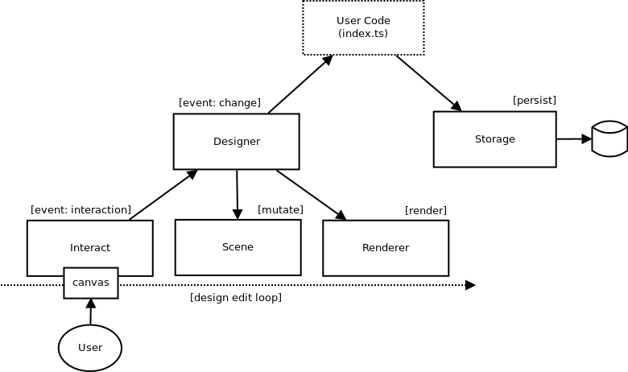

# interactive shapes

### overview

This is a test project to experiment with 2D design / editing surfaces in the browser. The goal of this project is to provide a simple basis to explore developing and modelling rich interactions, user collaboration functionality, and general API development related to design orientated applications.

This project is offered as is for anyone who finds it useful or interesting.

### running the project

clone this project and run the following from the project root. This will start a http server on port 5000.

```
yarn start
```

### design

This application is composed of the following high level components.



- renderer - 2D canvas scene renderer
- scene - 2D scene graph composed of mesh, geometry and material primitives.
- interact - canvas event emitter. normalizes events specific to vector based mouse interactions
- designer - preforms scene graph mutations and renders.
- storage - some storage interface